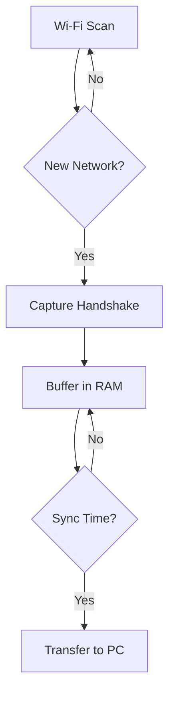

# Wi-Fi Security Toolkit called RPScanner🛡️

A dual-device system for Wi-Fi data collection and security analysis.  
**Legal use only** - Requires explicit permission for network testing.

[](LICENSE)


## Table of Contents
- [🖥️ Hardware Requirements](#-hardware-requirements)
- [🚀 Quick Start Guide](#-quick-start-guide)
- [⚙️ Configuration](#-configuration)
- [🛠️ How It Works](#-how-it-works)
- [🚨 Troubleshooting](#-troubleshooting)
- [⚠️ Legal Disclaimer](#-legal-disclaimer)

---

## 🖥️ Hardware Requirements

### Raspberry Pi Zero 2W (Collector)
| Component          | Specification                             |
|--------------------|-------------------------------------------|
| OS                 | Raspberry Pi OS Lite (64-bit)             |
| Wi-Fi Card         | Brostrend 1200AC (Monitor mode capable)   |
| Storage            | 32GB+ microSD card (Class 10 recommended) |
| Power              | Powerbank for some energy                 |

### PC (Brute-Force Station)
| Component          | Specification                          |
|--------------------|----------------------------------------|
| OS                 | Windows 10/11                          |
| Tools              | Hashcat v6.2+, Python 3.10+            |

---

## 🚀 Quick Start Guide

### Raspberry Pi Setup (5-minute setup)

1. **Flash the OS**  
   Use Raspberry Pi Imager to install **Raspberry Pi OS Lite** (64-bit).

2. **Enable SSH/Wi-Fi**  
   Create an empty file named `ssh` and `wpa_supplicant.conf` in the boot partition:
   ```bash
   touch /Volumes/boot/ssh
   echo 'country=US
   ctrl_interface=DIR=/var/run/wpa_supplicant GROUP=netdev
   update_config=1' > /Volumes/boot/wpa_supplicant.conf
   ```

3. **Install Dependencies**
   ```bash
   sudo apt update && sudo apt upgrade -y
   sudo apt install hcxdumptool hcxpcaptool python3-pip -y
   pip3 install requests psutil
   ```

4. **Clone Repository**
   ```bash
   git clone https://github.com/majevva/RPScanner.git
   cd wifi-security-toolkit
   ```

### PC Setup (Windows)

#### Install Essentials
- Python 3.10+
- Hashcat 6.2+
- Git for Windows

#### Configure Environment
   ```powershell
   # Clone repository
   git clone https://github.com/majevva/RPScanner.git
   cd wifi-security-toolkit

   # Create virtual environment
   python -m venv .venv
   .venv\Scripts\activate
   pip install -r requirements.txt
   ```

---

## ⚙️ Configuration

### Raspberry Pi Collector
Edit `config.ini`:
```ini
[collector]
interface = wlan1          # Monitoring interface
buffer_size = 512MB        # RAM buffer before SD write
sync_interval = 3600       # 1 hour between syncs
whitelist_networks = homewifi,trustedssid
```

### PC Brute-Force Station
Edit `hashcat_config.json`:
```json
{
  "wordlist_path": "wordlists/rockyou.txt",
  "rules": "best64.rule",
  "hash_mode": 22000,
  "performance_profile": "high"
}
```

---

## 🛠️ How It Works

### Data Collection Flow


### Key Features
📡 **Smart Scanning**: Ignores known networks using MAC/SSID filtering  
🔋 **Power Resilience**: Survives car power interruptions with capacitor buffer  
🔄 **Dual Sync**: Automatic Wi-Fi transfer + manual USB backup  
📊 **Result Tracking**: SQLite database with timestamped results  

---

## 🚨 Troubleshooting

### Common Issues
| Symptom               | Fix |
|-----------------------|------------------------------------------|
| "Interface not found" | `sudo airmon-ng check kill`            |
| Sync failures         | Check `whitelist_networks` in config   |
| Buffer overflow      | Reduce `buffer_size` in `config.ini`   |
| Hashcat GPU errors   | Update NVIDIA drivers to v535+         |

### Systemd Service (Raspberry Pi)
```bash
# Install as background service
sudo cp wifi-collector.service /etc/systemd/system/
sudo systemctl enable wifi-collector
sudo systemctl start wifi-collector
```

---

## ⚠️ Legal Disclaimer
**WARNING:** This tool must only be used on:

- Networks you own
- Networks with written permission from owner
- CTF/educational environments

Misuse may result in criminal charges. By using this software, you agree to be solely responsible for its applications.

---

## 📜 License
MIT License - See [LICENSE](LICENSE) for details.